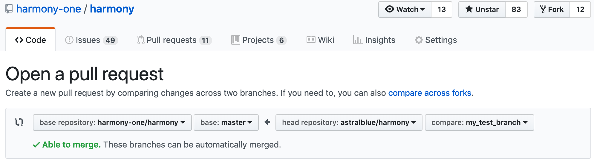

# Git Cheat Sheets

**DISCLAIMER:** This is NOT a team policy document.
It’s a collection of best practices FYI.

## Fork-based Workflow

### Create fork – once per each repo

1. If you haven’t yet, “go get” the main repo to clone it into `$GOPATH/src`:

       go get github.com/harmony-one/harmony

2. Go to the GitHub page of the main repo,
   such as https://github.com/harmony-one/harmony.

3. Fork into your own account (`astralblue`, `mikedoan`, `LeoHChen`, `rlan35`…)

4. **Do not clone the fork.**  Instead, **add your fork as a remote in the main clone,** and push to it by default
   (substitute your account name, such as `LeoHChen`,
   for the `ME` placeholder below):

       cd ~/go/src/github.com/harmony-one/harmony
       git remote add -f ME git@github.com:ME/harmony
       git config --local --replace-all remote.pushDefault ME

### Start a working branch

1. Create a branch in your local clone
   (choose a name, then substitute it for the `MY_WORK` placeholder below),
   making it track the target branch where you will eventually be merging into
   (`origin/master` for example):
   
       git checkout -b MY_WORK --track origin/master
       git pull

2. Hack away!

### Sync with upstream

1. Commit or stash your local changes away.

2. A simple pull would merge (rebase if `--rebase`) upstream updates
   into your working copy:

       git pull

3. If you stashed your local changes, bring them back.

4. Keep hacking!

### Checkpoint/publish your progress

1. A simple push would back your progress up in your own fork:

       git push
       
2. Keep hacking!

### File a pull request

1. Visit this URL
   (replace the `ME` and `MY_WORK` placeholders with your username and branch):

       https://github.com/ME/harmony/pull/new/MY_WORK

   **Note:** For convenience, the above URL is shown on the first push to your fork.

2. Examine the pull request page.  Make sure:

    1. The “base repository” and “base” are the target
       (such as harmony-one master);

    2. The “head repository” and “compare” are the source
       (that is, your fork & branch).

    

3. Proceed to open a pull request.

